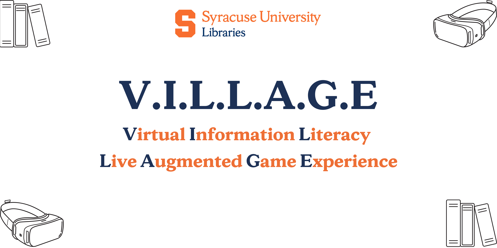

 

  

  

    project_description
     
    <a href="https://researchguides.library.syr.edu/sulvr"><strong>Explore the page »</strong></a>
     
     
    <a href="https://github.com/github_username/repo_name">View Demo</a>
    ·
    <a href="https://github.com/github_username/repo_name/issues">Report Bug</a>
    ·
    <a href="https://github.com/github_username/repo_name/issues">Request Feature</a>
  

<!-- TABLE OF CONTENTS -->

  
Table of Contents

  <ol>
    <li>
      <a href="#about-the-project">About The Project</a>
      <ul>
        <li><a href="#built-with">Built With</a></li>
      </ul>
    </li>
    <li>
      <a href="#getting-started">Getting Started</a>
      <ul>
        <li><a href="#prerequisites">Prerequisites</a></li>
        <li><a href="#installation">Installation</a></li>
      </ul>
    </li>
    <li><a href="#roadmap">Roadmap</a></li>
    <li><a href="#contributing">Contributing</a></li>
    <li><a href="#license">License</a></li>
    <li><a href="#contact">Contact</a></li>
    <li><a href="#acknowledgments">Acknowledgments</a></li>
  </ol>

<!-- ABOUT THE PROJECT -->
## About the project

##### Virtual reality(VR) has gained greater attention in the past few years. VR technology has become more accessible in both cost and technological advancements. Devices such as the Meta Quest (formerly Oculus Quest 2) are less expensive, easier to maintain, develop, and distribute. Stanford University launched their first course offered in VR, Comm 166/266. Over the years libraries have embraced new technologies for both research and teaching needs in academics. Libraries have also used gamification to teach information literacy. One type of gamification is an escape room game also known as a puzzle room or exit game. The goal is to “escape” a room by solving puzzles. Puzzles are designed based on the ACRL Framework for Information Literacy. Up until now, libraries have only explored and successfully implemented escape rooms in the real world or online using two-dimensional spaces (storyboard web pages). This project aims to explore the possibility of using library escape room games in VR for information literacy classes.

(<a href="#top">back to top</a>)

### Built With

* ![mac][mac.js]
* ![windows][windows.js]
* ![python][python.js]
* ![markdown][markdown.js]

(<a href="#top">back to top</a>)

<!-- GETTING STARTED -->

 # Goal: Develop a VR library-theme escape room game
the goal of the project to develop an open-source library-theme escape room game in virtual reality. The game will then be used by libraries for information literacy learning.

the project will also address the following:
* How quickly and easily can a VR game be developed using little to no coding.
* The effectiveness of a VR game for information literacy.
* The viability of distribution of the source code for the project.
* ROI for libraries and institutions.
* Feasibility of implementation of a VR session.

### Prerequisites

<!-- ROADMAP -->
##  Work needed to accomplish the goal

- [ ] puzzle designed
- [ ] Game coding
- [ ] 3D model design
    - furniture, room, object, etc
- [ ] ACRL Framework for Information Literacy implementation
- [ ] Game deployment
- [ ] Game testing
- [ ] Class session lesson plan

See the [open issues](https://github.com/github_username/repo_name/issues) for a full list of proposed features (and known issues).

(<a href="#top">back to top</a>)

<!-- CONTRIBUTING -->
## Contributors

- [ ] Lead project manager & developer: **Juan Denzer**, Engineering & Computer Science Librarian (SUL)
- [ ] Project manager: **Natalie LoRusso**, Reference & User Experience Librarian (SUL)
- [ ] Game designer: **Chloe Guedalia**, MLIS Graduate student (iSchool)
- [ ] Game designer: **Alayna Vander Veer**, MLIS Graduate student (iSchool)
- [ ] Game designer: **Rachel Hogan**, MLIS Graduate student (iSchool)
- [ ] Game designer: **cheng zhongquan**(peter), computer science and engineer students(ECS)

<!-- LICENSE -->
## License

Distributed under the MIT License. See `LICENSE.txt` for more information.

(<a href="#top">back to top</a>)

<!-- CONTACT -->
## Contact

Juan Denzor - jpdenzer@syr.edu
Natalie Lorusso - ncloruss@syr.edu

Project Link: [https://github.com/github_username/repo_name](https://github.com/github_username/repo_name)

(<a href="#top">back to top</a>)

<!-- ACKNOWLEDGMENTS -->
## Acknowledgments

* 
* 
* 

(<a href="#top">back to top</a>)

## Estimate budget

<!-- MARKDOWN LINKS & IMAGES -->
<!-- https://www.markdownguide.org/basic-syntax/#reference-style-links -->
[contributors-shield]: https://img.shields.io/github/contributors/github_username/repo_name.svg?style=for-the-badge
[contributors-url]: https://github.com/github_username/repo_name/graphs/contributors
[forks-shield]: https://img.shields.io/github/forks/github_username/repo_name.svg?style=for-the-badge
[forks-url]: https://github.com/github_username/repo_name/network/members
[stars-shield]: https://img.shields.io/github/stars/github_username/repo_name.svg?style=for-the-badge
[stars-url]: https://github.com/github_username/repo_name/stargazers
[issues-shield]: https://img.shields.io/github/issues/github_username/repo_name.svg?style=for-the-badge
[issues-url]: https://github.com/github_username/repo_name/issues
[license-shield]: https://img.shields.io/github/license/github_username/repo_name.svg?style=for-the-badge
[license-url]: https://github.com/github_username/repo_name/blob/master/LICENSE.txt
[linkedin-shield]: https://img.shields.io/badge/-LinkedIn-black.svg?style=for-the-badge&logo=linkedin&colorB=555
[linkedin-url]: https://linkedin.com/in/linkedin_username
[product-screenshot]: images/screenshot.png
[mac.js]: https://img.shields.io/badge/mac%20os-000000?style=for-the-badge&logo=apple&logoColor=white
[mac-url]: https://www.apple.com/macos/monterey/
[windows.js]: https://img.shields.io/badge/Windows-0078D6?style=for-the-badge&logo=windows&logoColor=white
[windows-url]: https://www.microsoft.com/en-us/windows
[python.js]:https://img.shields.io/badge/Python-3776AB?style=for-the-badge&logo=python&logoColor=white

[markdown.js]: https://img.shields.io/badge/Markdown-000000?style=for-the-badge&logo=markdown&logoColor=white
